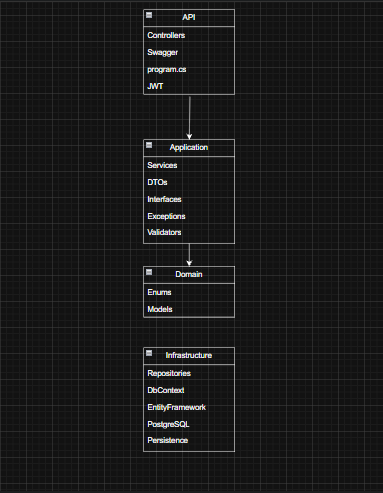

## Diagrama Entidad-Relación

A continuación se presenta el diagrama entidad-relación de la base de datos utilizada en el proyecto.  
Este modelo representa las entidades principales del sistema de gestión de biblioteca y las relaciones existentes entre ellas.

Se incluyeron entidades como libros, autores, categorías, usuarios, préstamos y reservas, permitiendo manejar correctamente la lógica del sistema y las relaciones entre los diferentes módulos de la aplicación.

## Diagrama de Arquitectura

A continuación se muestra el diagrama de arquitectura utilizado en el proyecto.  
Se implementó Onion Architecture para separar responsabilidades entre capas y mantener un código más organizado, escalable y fácil de mantener.

La API se encarga de manejar los endpoints y autenticación, la capa Application contiene la lógica de negocio, Domain representa las entidades principales del sistema y Infrastructure maneja el acceso a datos mediante Entity Framework Core y PostgreSQL.

